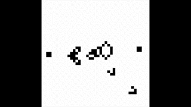

# Netlogo Models
A recopilation of different dynamical systems simulated in Netlogo.

##### Cell Competence
Competence model between healthy and cancer cells.

##### Game of Life
The Game of Life by Conway is a cellular automata,in which each cell is depicted either alive or white dead. The rules are the following:
1. If a living cell has 2 or 3 living neighbors, survives.
2. If a dead cell has 3 living neighbors, revives.
3. Otherwise the cell dies.

    

