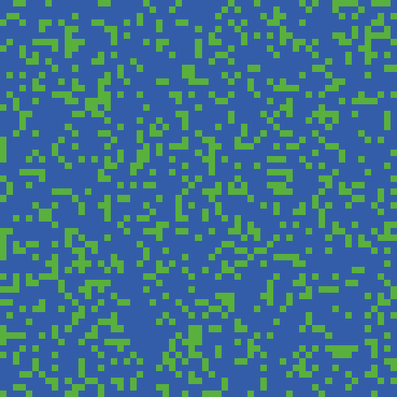

# Dynamical Models
A recopilation of different models of [dynamical systems](https://en.wikipedia.org/wiki/Dynamical_system) simulated in NetLogo.

1. [Cell competence](https://github.com/sgalella/DynamicalModels/blob/master/images/Cell_Competence.jpg)

2. [Lotka-Volterra model](https://en.wikipedia.org/wiki/Lotka–Volterra_equations)

3. [Belousov-Zhabotinsky reaction](https://en.wikipedia.org/wiki/Belousov–Zhabotinsky_reaction)

   

    
 	  
  	

